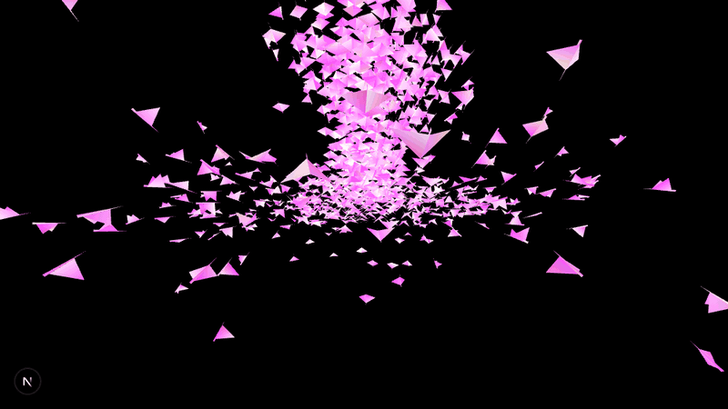

<div align="center">

# 🪽 NEON FLOCK — Interactive Animation Playground

### A tiny playground for big, beautiful motion.

An interactive, full-screen animation project built with **Next.js**, **Three.js**, and **Vanta.js**. Watch a neon flock sweep across a deep black canvas, then explore the experimental 3D globe and shader scenes included in the project.


<br />



<sub>🎞️ A capture of the live Birds animation. Move your pointer over the scene to interact.</sub>

</div>

## ✨ What’s inside

- **A full-screen animated flock** with Vanta Birds, a black canvas, and vivid pink and cyan colors.
- **Pointer and touch interaction** so the scene responds to your movement.
- **A reusable 3D globe experiment** with photo markers, rotation, and configurable controls.
- **A shader smoke experiment** ready to explore.
- A responsive, edge-to-edge canvas built with React and Three.js.

> The Birds scene is the animation currently shown on the home page. The globe and smoke components are included as experiments and are not currently mounted there.

## 🚀 Run it locally

You’ll need [Node.js](https://nodejs.org/) and npm.

```bash
npm install
npm run dev
```

Open [http://localhost:3000](http://localhost:3000) and enjoy the flight. 🐦

## 🎛️ Explore the experiments

| Scene | File | What it does |
| --- | --- | --- |
| Neon Birds | [`components/ui/BirdsBackground.tsx`](./components/ui/BirdsBackground.tsx) | Full-screen Vanta flock with mouse and touch controls. |
| 3D Globe | [`components/ui/3d-globe.tsx`](./components/ui/3d-globe.tsx) | React Three Fiber globe with optional photo markers, atmosphere, and orbit controls. |
| Smoke Shader | [`app/components/smokescreen.tsx`](./app/components/smokescreen.tsx) | Shader preview component for a smoke-like visual. |

To switch scenes, edit [`app/page.tsx`](./app/page.tsx) and mount the component you want to try.

## 🧰 Built with

- [Next.js](https://nextjs.org/) and [React](https://react.dev/)
- [TypeScript](https://www.typescriptlang.org/)
- [Three.js](https://threejs.org/) and [React Three Fiber](https://r3f.docs.pmnd.rs/)
- [Vanta.js](https://www.vantajs.com/) for the animated Birds background
- [Tailwind CSS](https://tailwindcss.com/) for styling

## 💜 About

Made as an animation playground to experiment with motion, color, and interactive 3D on the web. Clone it, change the palette, switch the scene, and make it your own.

---

<div align="center">

**Made to move. Built to play.** ✨

</div>
